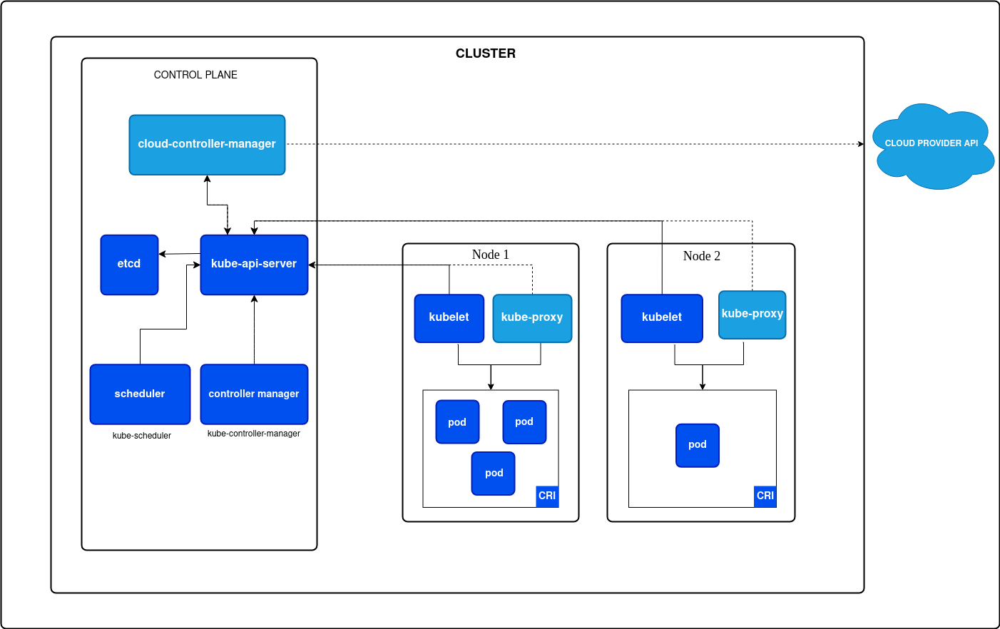

# Cluster Architecture

Cluster Architecture defines the overall structure of Kubernetes, consisting of control plane components and worker nodes that manage and run containerized applications. 

## Control Plane

It is management layer of Kubernetes responsible for maintaining cluster state, scheduling workloads, and handling API requests.

1. **etcd**: A distributed key-value store used by Kubernetes to persist cluster configuration, state, and metadata.
2. **kube-api-server**: The central API component that exposes the Kubernetes API and processes all administrative and operational requests to the cluster.
3. **Scheduler**: Assigns newly created Pods to appropriate worker nodes based on resource availability and shceduling policies.
4. **Controller Manager**: Runs controllers that continuously monitor cluster state and ensure the desired state matches the actual state.
5. **Cloud Controller Manager**: Integrates Kubernetes with cloud provider APIs to manage resources like load balancers, nodes, and networking.

## Worker Nodes

Worker nodes are machine in the cluster that runs application workloads inside Pods.

1. **Kubelet**: An agent running on each worker node that ensures containers in Pods are running as specified.
2. **Kube-proxy**: Maintains network rules on nodes to enable communication between Pods and Kubernetes Services.
3. **Pod**: The smallest deployable unit in Kubernetes that encapsulates one or more containers sharing networking and storage.
4. **CRI**: Container Runtime Interface is a plugin interface that enables Kubernetes to use different container runtimes such as containerd or CRI-O.

---