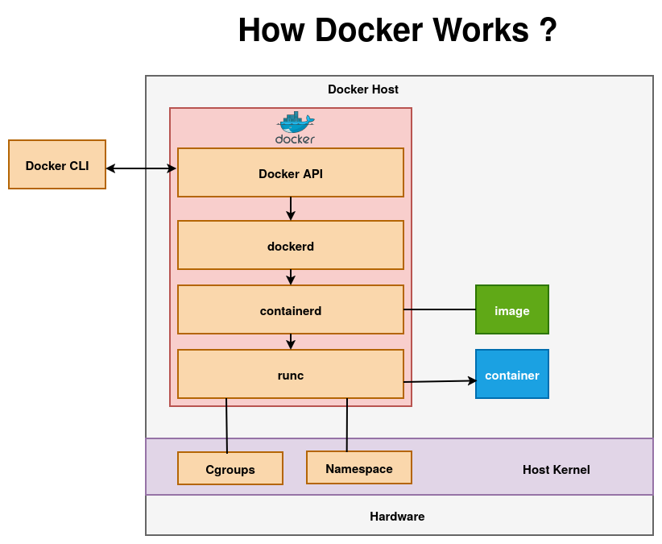
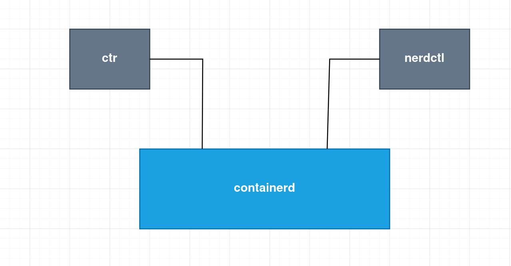
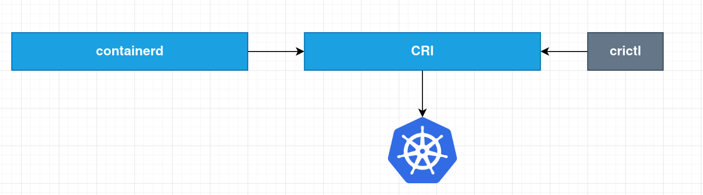

# Docker vs Containerd

## Docker 

Docker is a complete platform for building, packaging, and running containers with developer-friendly tools.

Docker runs containers by turning your CLI command into an API request that the Docker daemon (dockerd) understands. The daemon prepares everything (images, network, storage) and hands execution to containerd, which manages the container lifecycle. Then runc actually starts the container as a process on the host.

## Container Runtime

Software responsible for running containers on a host system.
Some common contaier runtimes are:
- **containerd**: A lightweight container runtime that manages container lifecycle, images, and storage.
- **CRI-O**: A Kubernetes-focused container runtime designed specifically to implement the CRI standard. 

## Open Container Initiative - OCI

OCI is an open standard that defines how container images should be built and how containers should run, ensuring compatibility across different container runtimes. Components of OCI are:
1. **Image Specification**: Defines the standard format for container images so they can run on any OCI-compliant runtime.
2. **Runtime Specification**: Defines how a container runtime should run containers on a host system.
3. **Distribution Specification**: Defines how container images are stored and distributed through registries.

## Containerd

**containerd** is a lightweight, OCI-compliant runtime manager that handles the container lifecycle. Docker internally uses containerd as its runtime, but containerd is an independent runtime that can run containers directly without the higher-level Docker platform.

- **ctr**: A low-level command-line interface used to directly interact with containerd for managing containers and images.
- **nerdctl**: A Docker-compatible CLI for containerd that provides familiar commands like run, build, and ps.
  
## Container Runtime Interface - CRI

A Kubernetes interface that allows the kubelet to communicate with different OCI compliant container runtimes like containerd or CRI-O.

Kubernetes uses containerd as the container runtime, where the kubelet talks to containerd via CRI to pull images and create, start, or stop containers in Pods.

- **crictl**: A command-line tool used to interact with CRI-compatible container runtimes (like containerd or CRI-O) for debugging and managing containers in Kubernetes nodes.

## ctr vs nerdctl vs crictl

| Tool        | Used With                        | Purpose                                                        | Interface Type              | Typical Use Case                                   |
| ----------- | -------------------------------- | -------------------------------------------------------------- | --------------------------- | -------------------------------------------------- |
| **ctr**     | containerd                       | Low-level CLI to directly interact with containerd             | Native containerd interface | Debugging containerd and testing runtime functions |
| **nerdctl** | containerd                       | Docker-compatible CLI for managing containers and images       | Docker-like interface       | Running and managing containers similar to Docker  |
| **crictl**  | CRI runtimes (containerd, CRI-O) | CLI to interact with container runtimes through Kubernetes CRI | Kubernetes CRI interface    | Debugging containers and pods on Kubernetes nodes  |
---

---
*Note: Docker was initially the primary container runtime used with Kubernetes. Later, Kubernetes introduced the Container Runtime Interface (CRI) to support any OCI-compliant container runtime. Docker did not natively implement CRI, so Kubernetes used a component called Dockershim to communicate with Docker. After Dockershim was deprecated and removed, Kubernetes began using containerd directly as the container runtime.*

---