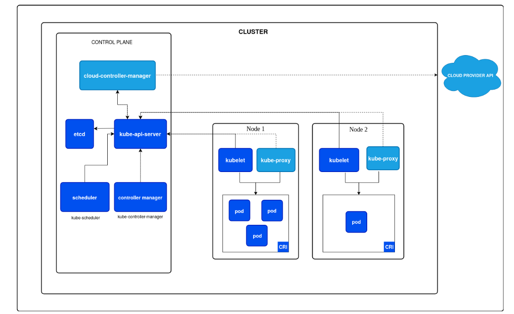

# Cluster Architecture

A Kubernetes cluster consists of a control plane plus a set of worker machines, called nodes, that run containerized applications. Every cluster needs at least one worker node in order to run Pods.

The worker node(s) host the Pods that are the components of the application workload. The control plane manages the worker nodes and the Pods in the cluster. In production environments, the control plane usually runs across multiple computers and a cluster usually runs multiple nodes, providing fault-tolerance and high availability.

---

# Kubernetes Control Plane Components

The **control plane** is responsible for managing the Kubernetes cluster. It makes **global decisions** (like scheduling Pods) and **detects and responds to cluster events** (for example, restarting a Pod if it fails).

> Control plane components can run on any machine in the cluster, but are usually run on dedicated nodes. In production, they are often deployed in a **highly available (HA)** setup across multiple machines.

---

## 1. kube-apiserver

* The **front end of the Kubernetes control plane**
* Exposes the **Kubernetes API**
* All components (kubectl, controllers, scheduler, nodes) communicate **only through the API server**
* Handles:

  * Authentication
  * Authorization
  * Admission control
  * Validation of API objects

### Key Points

* Main implementation: `kube-apiserver`
* **Stateless component**
* Can be **scaled horizontally** by running multiple instances behind a load balancer

---

## 2. etcd

* **Consistent and highly available key-value store**
* Stores **all cluster state and configuration data**
* Source of truth for Kubernetes

### Key Points

* Critical component — **data loss = cluster loss**
* Must have:

  * Regular **backups**
  * Secure access (TLS, authentication)
* Used only by the API server (not accessed directly by users)

---

## 3. kube-scheduler

* Watches for newly created Pods **without a node assigned**
* Selects the **best node** for each Pod

### Scheduling Factors

* CPU and memory requirements
* Node selectors and labels
* Taints and tolerations
* Affinity and anti-affinity rules
* Data locality
* Inter-pod interference
* Deadlines and priorities

### Key Point

* Scheduler **does not run Pods**
* It only **decides where Pods should run**

---

## 4. kube-controller-manager

* Runs **controller processes** that maintain the desired cluster state
* Each controller is a **control loop** that:

  * Watches current state
  * Compares with desired state
  * Takes action to fix differences

### Important Controllers

* **Node Controller**

  * Detects node failures and reacts
* **Job Controller**

  * Ensures Jobs run to completion
* **EndpointSlice Controller**

  * Maintains EndpointSlice objects for Services
* **ServiceAccount Controller**

  * Creates default ServiceAccounts for new namespaces

### Key Points

* All controllers are compiled into **one binary**
* Logically separate but run as a **single process**

---

## 5. cloud-controller-manager

* Integrates Kubernetes with **cloud provider APIs**
* Separates cloud-specific logic from core Kubernetes logic

### When It Runs

* Runs **only in cloud environments**
* Not present in:

  * On-prem clusters
  * Local setups (Minikube, Kind, learning clusters)

### Cloud-Dependent Controllers

* **Node Controller**

  * Checks if a node was deleted from the cloud
* **Route Controller**

  * Manages cloud network routes
* **Service Controller**

  * Creates, updates, and deletes cloud load balancers

### Key Points

* Runs as a **single binary**
* Can be **scaled horizontally** for high availability

---

## Summary Table

| Component                | Responsibility                  |
| ------------------------ | ------------------------------- |
| kube-apiserver           | API entry point for the cluster |
| etcd                     | Stores all cluster data         |
| kube-scheduler           | Assigns Pods to nodes           |
| kube-controller-manager  | Maintains desired state         |
| cloud-controller-manager | Handles cloud-specific logic    |

---

# Kubernetes Node Components

**Node components** run on **every node** in the cluster. They are responsible for maintaining running Pods and providing the **container runtime environment**.

---

## 1. kubelet

* An **agent** that runs on each node in the cluster
* Ensures that containers described in **PodSpecs** are running and healthy

### Responsibilities

* Receives Pod specifications from:

  * kube-apiserver
* Creates, monitors, and restarts containers as needed
* Reports node and Pod status back to the API server

### Key Points

* Manages **only Kubernetes-created containers**
* Does **not** manage containers started outside Kubernetes
* Communicates with the container runtime using **CRI**

---

## 2. kube-proxy (Optional)

* A **network proxy** that runs on each node
* Implements part of the **Kubernetes Service** abstraction

### Responsibilities

* Maintains **network rules** on nodes
* Enables communication:

  * Pod ↔ Pod
  * Pod ↔ Service
  * External ↔ Service

### How It Works

* Uses:

  * OS packet filtering (iptables, nftables, IPVS), or
  * User-space forwarding (fallback)

### Key Points

* Required for Services in many setups
* **Not needed** if:

  * A CNI plugin provides equivalent Service routing

---

## 3. Container Runtime

* Core component that allows Kubernetes to **run containers**
* Manages the **lifecycle of containers**

### Responsibilities

* Pull container images
* Start and stop containers
* Manage container isolation and resource usage

### Supported Runtimes

* `containerd`
* `CRI-O`
* Any runtime implementing **CRI (Container Runtime Interface)**

---

# Kubernetes Addons

**Addons** extend cluster functionality using Kubernetes resources such as:

* `Deployment`
* `DaemonSet`
* `Service`

> Addons typically run in the **kube-system** namespace.

---

## 1. DNS (CoreDNS)

* **Essential addon** for every Kubernetes cluster
* Provides DNS resolution for Kubernetes Services

### Key Points

* Automatically added to Pod DNS configuration
* Enables:

  * Service discovery
  * Pod-to-Service communication
* Most clusters use **CoreDNS**

---

## 2. Web UI (Dashboard)

* Web-based user interface for Kubernetes
* Used for:

  * Managing applications
  * Troubleshooting cluster issues
  * Viewing resources and logs

### Key Points

* Not recommended for production admin access
* Mostly used for learning, debugging, and demos

---

## 3. Container Resource Monitoring

* Collects **time-series metrics** for containers and nodes
* Stores metrics in a centralized database

### Common Components

* Metrics Server
* Prometheus
* Grafana (UI)

### Use Cases

* Autoscaling (HPA)
* Performance monitoring
* Capacity planning

---

## 4. Cluster-level Logging

* Centralized logging solution for the cluster
* Collects logs from all containers and nodes

### Typical Stack

* Fluentd / Fluent Bit
* Elasticsearch / Loki
* Kibana / Grafana

### Key Points

* Kubernetes does **not store logs permanently**
* External log storage is required

---

## 5. Network Plugins (CNI)

* Implement the **Container Network Interface (CNI)** specification
* Handle Pod networking

### Responsibilities

* Assign IP addresses to Pods
* Enable Pod-to-Pod communication
* Enforce network policies (if supported)

### Common CNI Plugins

* Calico
* Flannel
* Cilium
* Weave Net

---

## Summary Table

| Component         | Purpose                  |
| ----------------- | ------------------------ |
| kubelet           | Manages Pods on the node |
| kube-proxy        | Service networking       |
| Container Runtime | Runs containers          |
| DNS               | Service discovery        |
| Dashboard         | Web-based cluster UI     |
| Monitoring        | Metrics collection       |
| Logging           | Centralized log storage  |
| CNI Plugins       | Pod networking           |

---

# Kubernetes Architecture Variations

While the **core components of Kubernetes remain the same**, the way they are **deployed, managed, and operated** can vary significantly. Understanding these architecture variations is important for designing clusters that meet specific **operational, performance, and scalability requirements**.

---

## Control Plane Deployment Options

Kubernetes control plane components can be deployed in multiple ways depending on the environment and tooling.

### 1. Traditional Deployment

* Control plane components run directly on:

  * Dedicated physical machines, or
  * Virtual machines
* Managed as **systemd services**

**Characteristics**

* Simple and explicit setup
* Less dynamic than container-based approaches
* Common in early Kubernetes deployments

---

### 2. Static Pods

* Control plane components run as **static Pods**
* Managed directly by the **kubelet**
* Pod manifests are stored on disk (for example: `/etc/kubernetes/manifests`)

**Characteristics**

* Used by tools like **kubeadm**
* Components are restarted automatically by kubelet
* Not managed via Kubernetes API (no Deployment/ReplicaSet)

---

### 3. Self-Hosted Control Plane

* Control plane runs **inside the Kubernetes cluster**
* Managed using:

  * Deployments
  * StatefulSets
  * Other Kubernetes resources

**Characteristics**

* Fully Kubernetes-native management
* Easier upgrades and scaling
* Higher operational complexity
* Less commonly used today

---

### 4. Managed Kubernetes Services

* Control plane is **fully managed by cloud providers**
* Examples:

  * Amazon EKS
  * Google GKE
  * Azure AKS

**Characteristics**

* No direct access to control plane nodes
* High availability handled by provider
* Reduced operational overhead
* Focus on workloads instead of infrastructure

---

## Workload Placement Considerations

Workload placement depends on **cluster size**, **performance needs**, and **organizational policies**.

### Common Placement Models

* **Small / Development Clusters**

  * Control plane and user workloads run on the same nodes
  * Cost-effective but less secure

* **Production Clusters**

  * Dedicated control plane nodes
  * User workloads run only on worker nodes
  * Improved stability and security

* **Specialized Setups**

  * Critical add-ons (monitoring, logging) may run on control plane nodes
  * Often controlled using:

    * Taints and tolerations
    * Node affinity

---

## Cluster Management Tools

Different tools deploy Kubernetes clusters using different architectural layouts.

### Common Tools

* **kubeadm**

  * Standard, upstream-supported tool
  * Uses static Pods for control plane
  * Common in learning and production setups

* **kops**

  * Popular for AWS
  * Automates cluster lifecycle
  * Manages infrastructure and Kubernetes together

* **Kubespray**

  * Ansible-based deployment
  * Highly customizable
  * Suitable for on-prem and hybrid environments

---

## Customization and Extensibility

Kubernetes provides strong extensibility for advanced use cases.

### Custom Schedulers

* Can run alongside the default scheduler
* Can completely replace the default scheduler
* Useful for:

  * Specialized workloads
  * Custom resource placement logic

---

### API Extensions

* **CustomResourceDefinitions (CRDs)**

  * Extend Kubernetes API with custom objects
* **API Aggregation**

  * Add new APIs that behave like native Kubernetes APIs

---

### Cloud Provider Integration

* Deep integration via **cloud-controller-manager**
* Enables:

  * Load balancer provisioning
  * Node lifecycle management
  * Cloud-native networking and storage

---

## Key Takeaway

Kubernetes architecture is **highly flexible**. Organizations can tailor their clusters by balancing:

* Operational complexity
* Performance
* Scalability
* Management overhead

This flexibility makes Kubernetes suitable for:

* Local development
* On-prem environments
* Large-scale cloud-native production systems

---

