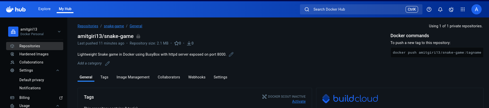
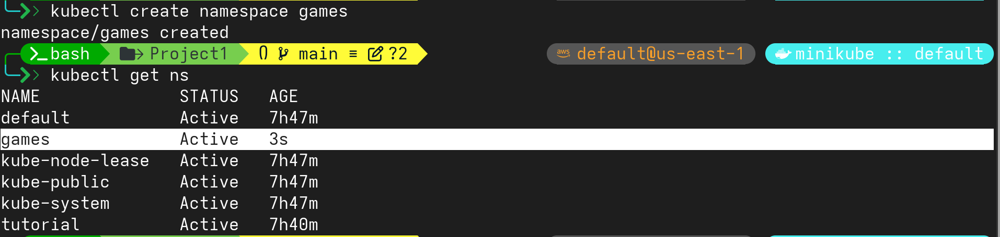
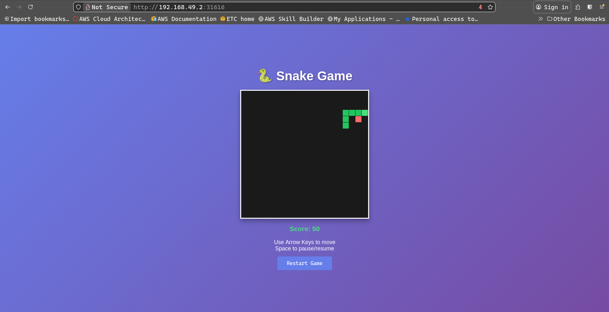

# Deploy your own custom-built Docker Image from a Private Container Registry as a K8s Deployment+Service with Documentation

## Prerequisites

- Docker Installed
- Kubernetes Cluster (Minikube | EKS | Kind)
- `kubectl` Configured
- Access to Private Container Registry (Dockerhub | ECR )

---
## 1. Create Private Container Registry



---

## 2. Dockerfile 

```bash
FROM busybox:latest

WORKDIR /app

# Copy code
COPY index.html .

# Expose port
EXPOSE 8000

# Run busybox httpd server
ENTRYPOINT ["httpd", "-f", "-v", "-p", "8000"]
```

---

## 3. Build Image

```bash
docker build -t <user>/<repo>:tag
```

---

## 4. Push Docker Image

```bash
# login
docker login

# push image
docker push <user>/<repo>:tag
```
---

## 5. Start Kubernetes Cluster 

```bash
minikube start
```
---

## 6. Create Namespace

```bash
# create namespace
kubectl create namespace games

# get namespace
kubectl get ns
```


---

## 7. Create Docker Registry Secret

```bash
# create secret
kubectl create secret docker-registry dockerhub-secret \
  --docker-server=docker.io \
  --docker-username=YOUR_DOCKERHUB_USERNAME \
  --docker-password=YOUR_DOCKERHUB_PASSWORD \
  --docker-email=YOUR_EMAIL \
  -n games

# get secret
kubectl -n games get secret

# describe secret
kubectl -n games describe secret dockerhub-secret

```
---

## 8. Manifest: deployment.yaml

```bash
apiVersion: apps/v1
kind: Deployment
metadata:
  name: game-app
  namespace: games
  labels:
    app: game-app
spec:
  replicas: 2
  selector:
    matchLabels:
      app: game-app
  template:
    metadata:
      labels:
        app: game-app
    spec:
      imagePullSecrets:
        - name: dockerhub-secret
      containers:
      - name: game-app
        image: amitgiri13/snake-game:1.0.0
        ports:
        - containerPort: 8000
          name: http
        env:
        - name: LOG_LEVEL
          value: "info"
        resources:
          requests:
            memory: "128Mi"
            cpu: "100m"
          limits:
            memory: "256Mi"
            cpu: "500m"
```
---

## 9. Manifest: service.yaml

```bash
apiVersion: v1
kind: Service
metadata:
  name: game-app-service
  namespace: games
  labels:
    app: game-app
spec:
  type: NodePort
  ports:
  - port: 80
    targetPort: 8000
    protocol: TCP
    name: http
  selector:
    app: game-app
```

---

## 10. Validate Manifest

```bash
kubectl apply --dry-run=client -f .
```
---

## 11. Appy deployment and service

```bash
# apply deployment
kubectl apply -f deployment.yaml

# get deployment
kubectl -n games get deployments

# describe deployment
kubectl -n games describe deployments game-app

# get pods
kubectl -n games get pods

# describe pods
kubectl -n games describe pods <pod-name>

# apply service
kubectl apply -f service.yaml

# get service
kubectl -n games get svc

# describe service
kubectl -n games describe service <svc-name>
```

---

## 12. Access The Application

```bash
minikube service game-app-service -n games
```

---