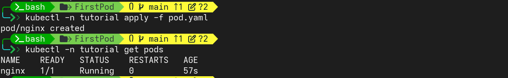

# Using Pods

Pods are the smallest deployable units of computing that you can create and manage in Kubernetes.

---

## Manifest: pod.yaml 

The following is an example of a Pod which consists of a container running the image nginx:1.14.2
```yaml
---
apiVersion: v1
kind: Pod
metadata:
  name: nginx
spec:
  Containers:
    - name: nginx
      image: ngix:1.14.2
      ports:
        - containerPorts: 80
```

---

## commands

```bash
# create namespace
kubectl create namespace tutorial

# list namespaces
kubectl get ns

# create pod
kubectl -n tutorial apply -f pod.yaml

# list pods
kubectl -n tutorial get pods

# describe pods
kubectl -n tutorial describe pods nginx

# delete pods
kubectl -n tutorial delete pods nginx

# check pods
kubectl -n tutorial get pods 
```
---

## Output



---